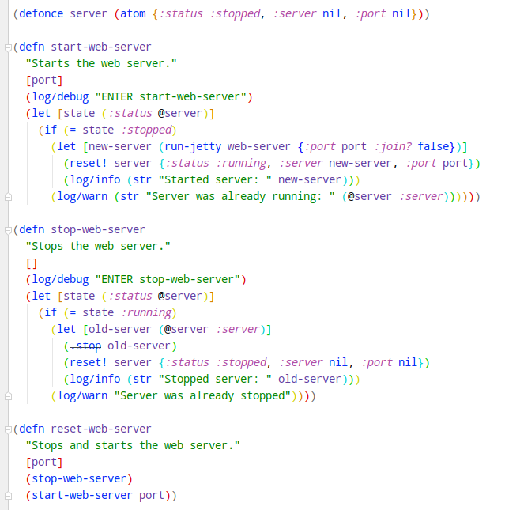
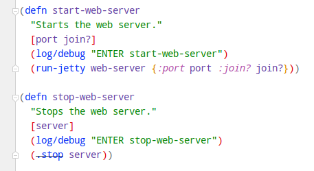
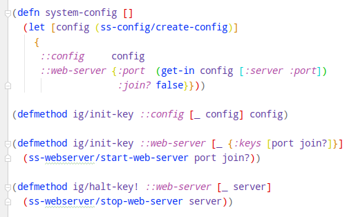

# Simple Server Integrant Version  <!-- omit in toc -->


# Table of Contents  <!-- omit in toc -->
- [Introduction](#introduction)
- [Technical Description](#technical-description)
- [Application State Management](#application-state-management)
  - [Manual State Management](#manual-state-management)
  - [State Management Using Integrant](#state-management-using-integrant)
  - [Comparison](#comparison)
- [Personal Experiences](#personal-experiences)
- [The Rest of the Application](#the-rest-of-the-application)
- [Simulating Integrant Workflow](#simulating-integrant-workflow)


# Introduction

I did this third version of my Simple Server exercise using Integrant (see previous versions in [clj-ring-cljs-reagent-demo](../../clj-ring-cljs-reagent-demo) and in [simple-server](../simple-server) ).

The idea of this third exercise was to learn and explore the [Integrant library](https://github.com/weavejester/integrant) and also the [Integrant-REPL workflow](https://github.com/weavejester/integrant-repl) which is popular in Metosin (and to see why it is so popular in Metosin).

NOTE:

- I don't iterate those Clojure development observations in this README.md that I already found out when I did the previous Clojure Simple Server versions - I recommend the reader to read the README.md file of those previous implementations if you are interested about it.
- Most of the application code in this new Simple Server implementation is same as in the previous Clojure Simple Server implementations (except those areas where I did most of the changes: application state management using Integrant etc. ).
- This implementation is not meant to be an example how to create a production level web server in Clojure - it is just my personal Clojure exercise.

If you are interested to read my personal observations regarding the five languages I used to implement this same web server you might be interested to read my [Five Languages, Five Stories](https://medium.com/@kari.marttila/five-languages-five-stories-1afd7b0b583f) blog post. (There is actually nowadays also an implementation using Kotlin, see my Github repo.)


# Technical Description

Simple Server is implemented using [Clojure](https://clojure.org/) and [Ring](https://github.com/ring-clojure). For routing I used [reitit](https://github.com/metosin/reitit). For state management I used [Integrant library](https://github.com/weavejester/integrant) and for the REPL related workflow I used [Integrant-REPL workflow](https://github.com/weavejester/integrant-repl).


# Application State Management

So, in this third Simple Server version I wanted to compare the workflow using no particular state management library (see: [simple-server](../simple-server)) and this new Simple Server version with the [Integrant library](https://github.com/weavejester/integrant). You can read my experiences without using any state management library in that previous exercise, see [README.md](../simple-server/README.md) in chapter "You Can Do It Without Application State Management Libraries". In this new README file in this chapter I focus on my experiences using Integrant and comparing these two strategies.

## Manual State Management

In the code below you can see how I did state management manually in the previous exercise:



So, the core of the state management in this manual solution is the server atom which is just a map with three keys (in defonce since if we reload the namespace in REPL we don't want to lose the atom and the web server instance). The ```:server ``` key holds the actual server instance, as you can see in ```start-web-server``` function. The ```stop-web-server``` function stops the server instance and resets the atom value. The ```reset-web-server``` function just call these two functions. And we have a custom state management implemented without any state management libraries. You can easily reset the web server in REPL using the reset-web server function.

The above mentioned manual state management solution is just fine at least with smaller implementations that have just 1-2 states (e.g. just the web server - whether it is listening connections or not). But if you need a more complex state management, possibly with dependencies between different parts of the state, then you might benefit using a dedicated state management library.

## State Management Using Integrant

Let's see how the same thing could be implemented using Integrant. The first part of the solution is pretty much the same, we need to have methods for starting and stopping the web server:



But this time we don't need any atom to store the web server instance since we let Integrant to take care of state managent - therefore our ```start-web-server``` function starts the web server and just returns the created (and started) web server instance.

Then the Integrant specific part.



We first create a system configuration (function ```system-config```). Basically the only thing here that we really need is the ```::web-server``` part which has the initialization values for our web server. Then we have integrant hooks ```ig/init-key``` and ```ig/halt-key!```. These methods are called by Integrant when we reset the Integrant managed state of our application. As you can see, we just call the previous functions ```start-web-server``` and ```stop-web-server```.

In REPL driven development you can then use three ```integrant.repl``` namespace functions: 

- go: start the system (in our case start the web server)
- halt: halt the system (in our case stop the web server)
- reset: reset the system

## Comparison

So, which one is better? I'm not sure. For smaller applications it might be feasible just to implement your custom state management - and one less dependency in your ```deps.edn``` file. But if you have a bigger application with a lot of states and dependencies between different parts of the states then you might benefit using a dedicated state management library. I actually ran a very informal gallup in Metosin Slack regarding whether Metosin programmers favor custom state management or use some state management library. Two developers favored custom state management, others some 8 guys (which clicked either emoji in Slack) favored state management, all of them Integrant. Considering that these guys are pretty seasoned Clojure programmers I would say that you won't miss your target if you choose Integrant.

# Personal Experiences

Using Integrant and IntelliJ IDEA + Cursive plugin works together quite nicely. You can create REPL commands in Cursive (IDEA: Tools -> REPL -> Add new REPL command). You can e.g. create a REPL command which calls Integrant ```reset``` function in user namespace, and assign a hot-key (e.g. M-h) with this REPL command. So, when ever you want to reset your REPL session (reload namespaces + reset Integrant managed state) you can just hit Alt-h and you are good to go. No wonder that one Metosin Clojurist broke a certain key in his Mac's keyboard - he said that he used the specific key for resetting his Integrant state - obviosly hundreds of times per day. Let's see how my "h" key is going to stand the future clojure sessions. (Actually just changed the key from "h" to "j" so that I don't have to move my righ index finger when resetting my Integrant state.)


TODO: TODO: Personal Experiences.


# The Rest of the Application

... is exactly same as the previous version of Simple Server. I thought that I could have provided this integrant version as Git branch, but then I thought it might be interesting to have the two versions explicitely side by side. And my next exercise will be to re-implement the Simple Frontend using [re-frame](https://github.com/day8/re-frame) - and I will take the latest version of Simple Server as a baseline for this work and make it a full-stack application, and at the same time study the workflow making full-stack app using Clojure and Clojurescript.

# Simulating Integrant Workflow

I must say that I cheated a bit. Since the rest of the application (except state management) is exactly the same as the previous version of the Simple Server application I didn't have the full experience of using Integrant workflow. But I simulated the workflow a bit so that I copy-pasted parts of Clojure namespaces from the previous version to this new version and tried to go/halt/reset application in REPL every now and then to have a feeling what it would have been fully to implement the app from scratch. Maybe I'll do my next green field Clojure exercise using Integrant and I can have a real experience how Integrant helps in the development phase.

