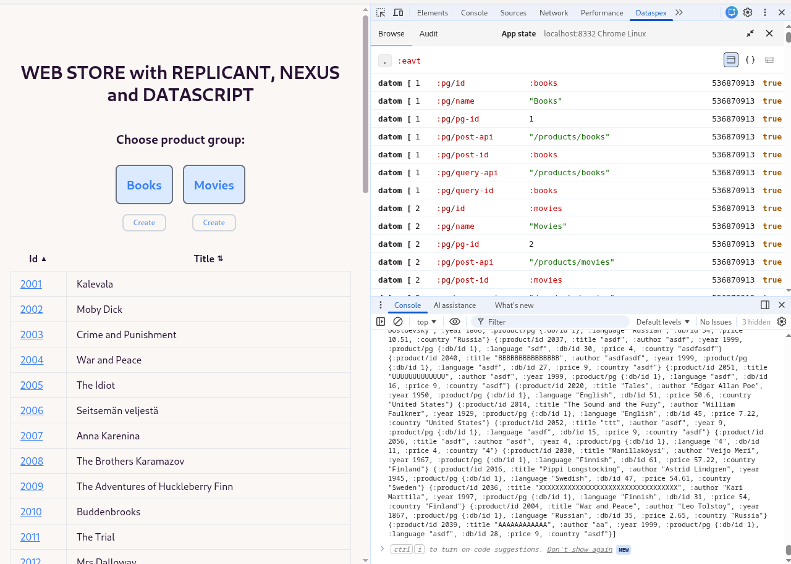

# Clojure Fullstack Exercise Using Replicant, Nexus and Datascript <!-- omit in toc -->

[](docs/app-screenshot.png)


## Table of Contents <!-- omit in toc -->

- [Introduction](#introduction)
- [Reference Material](#reference-material)
- [The Libraries](#the-libraries)
  - [Replicant](#replicant)
  - [Nexus](#nexus)
  - [Datascript](#datascript)
  - [Dataspex](#dataspex)
- [Frontend Initialization](#frontend-initialization)
- [Nexus Actions and Effects](#nexus-actions-and-effects)
- [Some Development Tricks Used in This Exercise](#some-development-tricks-used-in-this-exercise)
  - [Move Calva Output to a New Window](#move-calva-output-to-a-new-window)
  - [Browser Developer Tool Console Logging](#browser-developer-tool-console-logging)
  - [Other Development Tricks](#other-development-tricks)

## Introduction

This exercise is a continuation for my earlier [Clojure Fullstack Exercise Using Replicant](https://www.karimarttila.fi/clojurescript/2025/02/28/clojurescript-with-replicant.html) in which I learned how to use the excellent [Replicant](https://github.com/cjohansen/replicant) library to build a frontend for my Webstore example.

In that previous exercise I built a custom dispatch system and used a Clojure Atom as my application store for storing the state of the frontend application. In this new exercise I use [Nexus](https://github.com/cjohansen/nexus) to do the heavy-lifting for creating the dispatch system, and instead of storing the application store in a Clojure Atom, I use [Datascript](https://github.com/tonsky/datascript).

So, only the frontend code is new / has been refactored to use Nexus and Datascript. The backend code and tooling is mostly the same as in the previous exercise (just bumped the newest library versions for the backend as well).

I wrote a short blog post related to the experiences when creating this winter vacation Clojure exercise: [TODO](TODO).

## Reference Material

I used [replicant-state-datascript repo](https://github.com/cjohansen/replicant-state-datascript.git) as an example how to setup `Nexus` + `Datascript`. Christian Johansen also provided me good help in the Clojurians Slack - Thanks! Christian also kindly reviewed the frontend source code related how I use Nexus, and the Blog post I wrote.

Links to the libraries:

- [Replicant](https://github.com/cjohansen/replicant)
- [Nexus](https://github.com/cjohansen/nexus)
- [Datascript](https://github.com/tonsky/datascript)
- [Dataspex](https://github.com/cjohansen/dataspex)

Links to the example projects:

- [replicant-state-datascript](https://github.com/cjohansen/replicant-state-datascript): An excellent example project which provides a skeleton for using Replicant + Nexus + Datascript. This example is all you need to get going.

## The Libraries

A short introduction to the libraries. Read more about the libraries in the link provided above.

### Replicant

[Replicant](https://github.com/cjohansen/replicant) is a data-driven rendering library for Clojure(Script). It renders hiccup to strings or DOM nodes.

I like the idea of Replicant. In the frontend world [React](https://react.dev/) dominates the scene at the moment, and there are a few React wrappers in the Clojure scene like [Reagent](https://github.com/reagent-project/reagent) and [UIx](https://uix-cljs.dev/). I have used Reagent and it is a good library to build React apps using Clojurescript. But when I was introduced to Replicant I realized that I hardly ever use the React ecosystem off-the-shelf components, and therefore I do not need to build the frontend using React. Replicant is a very good light-weight alternative to using React.

### Nexus

In my previous [Replicant exercise](https://www.karimarttila.fi/clojurescript/2025/02/28/clojurescript-with-replicant.html) I used a custom built dispatch mechanism (that I mostly borrowed from others, see the source code for more information). This is just fine. But now that we have [Nexus](https://github.com/cjohansen/nexus), why not let it handle the dispatching mechanism.

### Datascript

[Datascript](https://github.com/tonsky/datascript) is an immutable in-memory database and Datalog query engine in Clojure and ClojureScript. Therefore it is a good match to store the frontend application events in Datascript database, and using [Datalog](https://en.wikipedia.org/wiki/Datalog) query language to query the application state for generating the UI.

### Dataspex

In that previous Replicant exercise I used the [Gadget extension](https://github.com/cjohansen/gadget-inspector) to visualize my data in the Chrome developer tools. In this new exercise I used [Dataspex](https://github.com/cjohansen/dataspex).

Dataspex is a Chrome / Firefox extension that you can use to visualize the data store of your frontend application, i.e. the Datascript database in this exercise. Dataspex is just amazing. You can see all datoms generated by your frontend application in the Dataspex window, and drill down to a specific datom. See the picture in the beginning of this README file for an example.

## Frontend Initialization

I borrowed from the excellent [replicant-state-datascript](https://github.com/cjohansen/replicant-state-datascript) repo the solution how to register the `datascript` database for watching changes, and trigger `Replicant/render`.

So, in the `add-watch` we create a triggering mechanism to watch changes in our Datascript database. And if there are changes, we create a view state (`view-state`) which has the application state for the Replicant to figure out what changes we need to make in the UI, and finally ask Replicant to render the UI (`(r/render !el (f-views/view view-state))`).

## Nexus Actions and Effects

I mostly borrowed the skeleton for Nexus actions and effects from the excellent [replicant-state-datascript](https://github.com/cjohansen/replicant-state-datascript) example application.

Read more about the difference between Nexus Actions and Effects in the [Nexus documentation](https://github.com/cjohansen/nexus). Just briefly the difference is that an effect is something that has a side-effect (e.g. making a http get or post, or changing the application store state), and an action just returns data, other actions and effects to be executed by the dispatching mechanism.

An effect example:

```clojure
(nxr/register-effect! :backend/post
                      (fn [_ system params]
                        (when goog.DEBUG (f-util/clog "effect :backend/post, params:" params))
                        (f-http/post system params)))
```

I.e.: just make a http post now with the parameters.


An action example:

```clojure
(nxr/register-action! :route/products
                      (fn [state params]
;; ...
                              [[:action/clear-new-product]
                               [:backend/fetch {:api query-api :pg pg}]
                               [:db/transact [[:db/add page-id :page/navigated {:page :products, :pg pg}]]]])))))
```

I.e.: clear new product page form, fetch products, and then add the new page we navigated to the Datascript database.

## Some Development Tricks Used in This Exercise

Here I document some development tricks that are not related to the libraries but more generic Clojure or Calva related development tricks I want to remember in the future.

### Move Calva Output to a New Window

Once you have connected Calva to your REPL, you get the output in the terminal / Calva Output. I like to move this window to another monitor (I have four monitors at my table) to see the Calva output window and VSCode editor at the same time (but in different monitors). Use VSCode command: `Terminal: Move Terminal into New Window`.

### Browser Developer Tool Console Logging

I have quite a lot Browser Console logging in the code base like this:

```clojure
(when goog.DEBUG (f-util/clog "register-action! :route/new, params:" params))
```

The reason is that this is an exercise, I was curious to see what kind of parameters there is in those functions while developing the functions. I left the console logging intentionally there if someone uses this exercise as an example to learn how to use these libraries.

### Other Development Tricks

You can read about other development tricks from the previous Replicant exercise - they are mostly the same in this exercise (using Babashka...).
