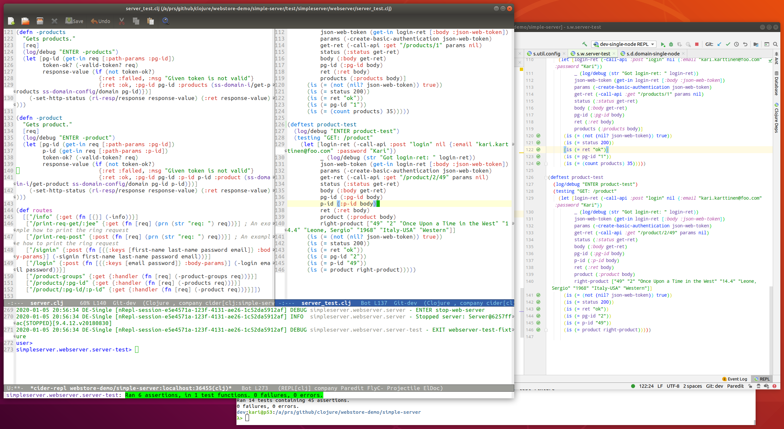

# Simple Server  <!-- omit in toc -->


# Table of Contents  <!-- omit in toc -->
- [Introduction](#introduction)
- [Technical Description](#technical-description)
- [Application State Management](#application-state-management)
- [Configuration Handling](#configuration-handling)
- [(REPL Driven) Clojure Development](#repl-driven-clojure-development)
  - [Using a REPL Scratch File](#using-a-repl-scratch-file)
  - [You Can Do It Without Application State Management Libraries](#you-can-do-it-without-application-state-management-libraries)
  - [Editing Clojure Code Efficiently](#editing-clojure-code-efficiently)
  - [Using IntelliJ IDEA + Cursive and Emacs + Cider Interchangeably](#using-intellij-idea--cursive-and-emacs--cider-interchangeably)
  - [Rich Comments](#rich-comments)
  - [Debugger](#debugger)
- [Logging](#logging)
- [Linting](#linting)
- [DynamoDB Functionality](#dynamodb-functionality)
  - [Local DynamoDB Docker Emulator](#local-dynamodb-docker-emulator)
  - [Using Cognitect AWS Clojure Library](#using-cognitect-aws-clojure-library)
- [IntelliJ IDEA / Cursive Run Configuration](#intellij-idea--cursive-run-configuration)
- [Unit Testing](#unit-testing)
- [Building Fat Jar and Running It](#building-fat-jar-and-running-it)
- [Next Steps for Myself](#next-steps-for-myself)
- [For a Clojure Learner](#for-a-clojure-learner)


# Introduction



This Clojure Simple Server is a re-implementation of my original Clojure [Simple Server](https://github.com/karimarttila/clojure/tree/master/clj-ring-cljs-reagent-demo/simple-server) I did some three years ago. I created the first version of that Clojure exercise server to learn to use Clojure. I created this new Clojure Simple Server version mainly to learn new Clojure libraries and ways of working as:

- Use [deps.edn](https://clojure.org/guides/deps_and_cli) instead of [Leiningen](https://leiningen.org/).
- Learn to use more effective REPL workflows as explained e.g. in [Chicago Clojure - 2017-06-21 - Stuart Halloway on Repl Driven Development](https://vimeo.com/223309989).
- Use [Cognitect AWS API](https://github.com/cognitect-labs/aws-api) instead of [Amazonica](https://github.com/mcohen01/amazonica) (NOTE: to be done later)
- Use Metosin libraries (reitit, NOTE: malli later).

NOTE:

- I don't iterate those Clojure development observations in this README.md that I already found out when I did the original Clojure Simple Server version - I recommend the reader to read the README.md file of that previous implementation if you are interested about it.
- Most of the application code in this new Simple Server implementation is same as in the first Clojure Simple Server implementation (except those areas where I did most of the changes: application state management etc. ).
- This implementation is not meant to be an example how to create a production level web server in Clojure - it is just my personal Clojure exercise.

If you are interested to read my personal observations regarding the five languages I used to implement this same web server you might be interested to read my [Five Languages, Five Stories](https://medium.com/@kari.marttila/five-languages-five-stories-1afd7b0b583f) blog post.


# Technical Description

Simple Server is implemented using [Clojure](https://clojure.org/) and [Ring](https://github.com/ring-clojure). For routing I used [reitit](https://github.com/metosin/reitit).


# Application State Management

I started to use the [mount](https://github.com/tolitius/mount) application state management library first. I created different Mount managed state entities e.g. for domain and server. But somehow I felt that using an application state management library and occasionally reloading all namespaces wasn't that productive for me. Sometimes I also got some weird errors that I couldn't resolve but I had to restart the REPL which I tried to avoid in this exercise. Finally I gave up, removed Mount and implemented a very simple custom state management for the web server only: just store the web server in an atom (and protect it with defonce). This was actually a good solution for me. It forced me to better understand the namespace concept, top level form concepts and the idea how to compile certain pieces of the code: individual S expressions, def and defn forms and the whole namespace (and avoid the "refresh-all", i.e. reload all namespaces workflow). See more in the "REPL Driven Development" chapter.


# Configuration Handling

I first started to use the [cprop](https://github.com/tolitius/cprop) configuration management library. Later on when I started to use [reitit](https://github.com/metosin/reitit) I switched also to use [maailma](https://github.com/metosin/maailma) configuration management library from the same company - [Metosin](https://www.metosin.fi/en/) (there is a specific reason for this - I decided to join the company and I thought it would be wise to learn to use some of Metosin's libraries beforehand). I created most of the application in "env-dev-single-node" mode (simulating the databases by reading the data from files). Later on (spring 2020) I created a DynamoDB version. In deps.edn I created various configuration aliases:

```clojure
:env-dev-single-node    {:extra-paths ["resources/config/dev-single-node"]}
:env-dev-local-dynamodb {:extra-paths ["resources/config/dev-local-dynamodb"]}
:env-dev-real-aws       {:extra-paths ["resources/config/dev-real-aws"]}
```

... and in those paths I had different config.edn files which had the development configurations for developing and testing various environments (single-node, local-dynamodb and real aws).


# (REPL Driven) Clojure Development

## Using a REPL Scratch File

I watched [Chicago Clojure - 2017-06-21 - Stuart Halloway on Repl Driven Development](https://vimeo.com/223309989) presentation and I realized that previously I had done REPL driven development completely wrong: I had written all REPL experimentation in the REPL editor. Instead you should use some scratch file and just send the S-expressions to the REPL for compilation and evaluation. This way you can have all your experimentation saved in a scratch file. In this exercise I actually created three kinds of Clojure files:

1. [src](https://github.com/karimarttila/clojure/tree/master/webstore-demo/simple-server/src): the actual production source code. This code will be packaged as the production deployment that runs the application in production. Will be added also into the Git repository, of course.
2. [test](https://github.com/karimarttila/clojure/tree/master/webstore-demo/simple-server/test): the test source code. This code is for testing purposes and is not shipped into production but will be added also into the Git repository, of course (e.g. to be run in the CI server).
3. [dev-src](https://github.com/karimarttila/clojure/tree/master/webstore-demo/simple-server/dev-src): the development source code. This code is just for development purposes and you don't necessarily add this code into the git repository (and you don't package this code as part of the deployment unit, of course). I have added this code also in this Git repository for educational purposes. In this directory I have two files:

    - [mydev.clj](https://github.com/karimarttila/clojure/blob/master/webstore-demo/simple-server/dev-src/mydev.clj): auxiliary functions to call APIs for experimental testing etc.
    - [myscratch.clj](https://github.com/karimarttila/clojure/blob/master/webstore-demo/simple-server/dev-src/myscratch.clj): the REPL scratch file I talked earlier. This file is pure unstructured mind flow. The idea of this file is what Stuart Halloway is talking about in the above mentioned presentation: do not write code in the REPL editor but in a scratch file. So, in this file I experimented various things when developing the application - take a look to have an idea what I was thinking about when developing the application.

In my scratch file I have experimental code or various short Clojure code snippets e.g. to start the server and test something quickly. Example:

```clojure
(do
  (in-ns 'simpleserver.webserver.server)
  (start-web-server (get-in simpleserver.util.config/config [:server :port]))
  (let [
        _ (require 'user)
        ret (user/do-get "/info" {})]
    (prn (str "/info returned: " ret)))
  (stop-web-server)
  (in-ns 'user))
```

I.e. jump into the right namespace, start the server, curl one api, stop the server and go back to user namespace.

## You Can Do It Without Application State Management Libraries

I realized that for a simple application like this exercise you don't actually need some application state management library (like Component, Mount or Integrant). And personally I also realized that it is better to learn to compile your Clojure code in those three categories (individual S-expression, def and defn top forms and the whole namespace) when you change something than just blindly *"refresh all namespaces and rely some application state management library dependency graph magic to do it for you so that you don't need fully to understand what actually happened".* Well, this is my personal feeling and there might be reasons for more complex applications to use some real application state management library - let's see when I have a chance to do something more complex using Clojure hopefully in the near future. So, my recommendation is first to try to manage without any application state management library and try to understand how to compile and load certain Clojure constructs manually. 

I watched Eric Normand's excellent [REPL Driven Development](https://purelyfunctional.tv/courses/repl-driven-development-in-clojure/) course and at the end of the course Eric says that he doesn't use any application state management libraries or "refresh all" workflows which was actually very releaving to hear since I was a bit concerned if I just somehow didn't "get" how to use these state management libraries. BTW. If you are learning Clojure or you have already done quite a bit Clojure programming but want to learn more effective ways for your Clojure workflow I highly recommend Eric Normand's courses in [PurelyFunctional.tv](https://purelyfunctional.tv/) (disclaimer: this is not a paid advertisement - I'm a subscriber and I just feel that I have personally learned enormously watching Eric's courses). There are a lot of excellent Clojure books that teach you Clojure programming and idioms but it is a totally different feeling to watch how a real Clojure guru works with Clojure code and at the same time explains the rationale what he is doing.


## Editing Clojure Code Efficiently

I have configured my Ubuntu key map so that I use Caps Lock key as a special key with other keys, e.g. Caps Lock with i,j,k,l keys are the arrow keys etc. This way I can keep my hands in the "asdf" and "jklö" positions all the time when writing code. I also use Emacs key mapping with some of my own tweaking in IntelliJ IDEA + Cursive so that it is fast to navigate from one window to another, jump to the namespace I'm editing, compile S-expressions and top level forms (defs and defns) and the whole namespace. I realized that with a good editor configuration and a good workflow + understanding how Clojure code gets compiled and loaded you can be quite productive using a very simple workflow: try code in the REPL scratch editor file, when you are content with the code, move the code to the actual Clojure namespace file, compile that section (top level form or the whole namespace), go back to scratch file, try calling that code in that namespace etc. And all this without ever leaving your hands from the standard "asdf"+"jklö" positions (it is also beneficial to learn to type the so called "ten finger system"). 

If you are interested about how to tweak the key mappings in Linux here is a short snippet from my Linux X11 configuration (google how to configure your Linux distro key mappings - I highly recommend to do so):

```
    key <AC06> { [  h,  H,  Home,  ...
    key <AC07> { [  j,  J,  Left,  ...
    key <AC08> { [  k,  K,  Down,  ...
    key <AC09> { [  l,  L,  Right, ...
    key <AC10> { [  odiaeresis,  Odiaeresis,  End, ...
```

One great productivity trick is to edit S-expressions as entitites (i.e. structural editing e.g. using [paredit](https://www.emacswiki.org/emacs/ParEdit) in your editor). You should learn how to use "slurping" and "barfing" and other ways to move S-expressions effectively in your code (see this excellent animated tutorial regarding that: [The Animated Guide to Paredit](http://danmidwood.com/content/2014/11/21/animated-paredit.html); if you are using IntelliJ IDEA + Cursive see this tutorial: [Cursive and Paredit](https://cursive-ide.com/userguide/paredit.html)). Once you get structural editing you will be surprised how fast Clojure programming is. E.g. I already mentioned that I use Emacs key binding in IntelliJ IDEA (since Emacs is my favorite editor in headless environments). Emacs uses ```<ctrl>-k``` to delete all characters from the cursor to the end of line, and actually moves the string to the "yank area" from with you can "yank" the string to a new position by ```<ctrl>-y```. I created a shortcut key ```<shift><ctrl>-k``` to delete the S-expression next to cursor and move the S-expression to the yank area, from which I can yank the S-expression to a new place. I use ```<shift><ctlr>-k``` with slurping and barfing all the time when editing Clojure code - it really makes editing Clojure code in actual source files and in the REPL scratch editor file a breeze.

I tried to make slurping and barfing as "natural" and "intuitive" to my keyboard practices and configuration as possible. Since I use the i,j,k,l keys as arrow keys (up, left, down, right) I found it natural to have the following configuration for slurping and barfing:

```elisp
     (define-key paredit-mode-map (kbd "C-M-j")  'paredit-backward-slurp-sexp)
     (define-key paredit-mode-map (kbd "M-<right>") 'paredit-forward-slurp-sexp)
     (define-key paredit-mode-map (kbd "C-M-l")  'paredit-backward-barf-sexp)
     (define-key paredit-mode-map (kbd "M-<left>")  'paredit-forward-barf-sexp)
```

Example: Slurp forward is using little finger in Caps-lock (which is Alt-Gr in my Linux X11 configuration) + thumb in Alt key (M) and then hitting "l" key (i.e. "right, since Alt-Gr is also pressed) with right ring finger - I feel this is natural since Caps-lock + l is mapped to "right", so: I'm slurping to the "right" direction.

You can use your imagination what kind of small optimizations to use with your key mapping configurations. I studied a few years classical guitar and the teacher always emphasized economy when moving fingers. I have tried to follow the same principle with my Clojure key mappings - economy of finger movements. Example. I realized that I often set REPL to a certain namespace and then load the namespace to REPL - therefore it is economically feasible to have those key strokes near to each other: M-å and M-ä. Oh, one note regarding these scandinavian characters (my native language is Finnish). We have in the Finnish keyboard three so called umlaut characters: å, ä and ö. These characters don't have native Emacs mappings, of course, - great: so it is feasible to use them with Meta (Alt) and Control keys (so you don't need "double characters like C-c + C-k). Below you can see the hotkeys that I use often with my REPL interaction when programming Clojure:

```elisp
     (define-key cider-mode-map (kbd "M-l")  'cider-eval-last-sexp)
     (define-key cider-mode-map (kbd "M-ö")  'cider-eval-defun-at-point)
     (define-key cider-mode-map (kbd "M-å")  'cider-repl-set-ns)
     (define-key cider-mode-map (kbd "M-ä")  'cider-load-buffer)
     (define-key cider-mode-map (kbd "C-å")  'cider-test-run-ns-tests)
     (define-key cider-mode-map (kbd "C-ä")  'cider-test-run-test) 
```


## Using IntelliJ IDEA + Cursive and Emacs + Cider Interchangeably

I used [IntelliJ IDEA](https://www.jetbrains.com/idea/) + [Cursive](https://cursive-ide.com/) plugin when implementing this Clojure exercise but just out of curiosity I wanted to try how it feels like to use [Emacs](https://www.gnu.org/software/emacs/) and [Cider](https://github.com/clojure-emacs/cider) when programming Clojure. The experience was quite pleasant. I managed to configure Emacs with the same theme I use with IntelliJ ([leuven](https://github.com/fniessen/emacs-leuven-theme) - mostly the same colors for the same syntactic/semantic entities) and the same hotkeys to compile code regarding one S-expression or the whole namespace, run all tests in the namespace or just the test under cursor etc. It took some time and some googling regarding Emacs [elisp](https://www.gnu.org/software/emacs/manual/html_node/elisp/) but finally I was pretty satisfied: now I can quite effortlessly use either IntelliJ IDEA + Cursive or Emacs + Cider when developing Clojure code - and the look-and-feel is pretty much the same. Why? Well, e.g. you can use Emacs + Cider in headless environments where you don't have GUI.

Emacs with various helpful packages like [company](https://company-mode.github.io/), [projectile](https://github.com/bbatsov/projectile), [clojure-mode](https://github.com/clojure-emacs/clojure-mode), [cider](https://github.com/clojure-emacs/cider), [eldoc-mode](https://www.emacswiki.org/emacs/ElDoc) turn Emacs to quite a powerful integrated development environment for Clojure. I recommend you to give Emacs a try. But I must say that I think I will stick with IntelliJ IDEA + Cursive when programming Clojure - IntelliJ is just a superb IDE.


## Rich Comments

This is a trick I learned from one of Stuart Halloway's excellent videos. Add at the end of your Clojure (production) file a "rich comment" which demonstrates how to use the entities defined in that namespace. Example from: [domain_single_node.clj](https://github.com/karimarttila/clojure/blob/master/webstore-demo/simple-server/src/simpleserver/domain/domain_single_node.clj):

```Clojure
(comment
  (-get-raw-products 1)
  )
```

I.e. a ```comment``` S-expression defines valid Clojure code that gets parsed *but not evaluated*. This way the code doesn't have any effect in production but during development it provides a nice way to give examples how to use entities in your Clojure code and also quickly evaluate the S-expressions inside the comment block (efficiently and quickly using your Clojure editor hot keys, of course).


## Debugger

You don't need a debugger with Clojure. :-) There is a debugger in IntelliJ IDEA + Cursive (and in Emacs + Cider), but I only once tried that it works. If you want to learn good debugging practices in Clojure you need to learn to use the REPL efficiently. Good resources are the above mentioned [REPL Driven Development](https://purelyfunctional.tv/courses/repl-driven-development-in-clojure/) course and [Chicago Clojure - 2017-06-21 - Stuart Halloway on Repl Driven Development](https://vimeo.com/223309989) video. E.g. in that video Stuart shows how to implement a simple breakpoint using Cursive - i.e. create your own debugger!


# Logging

I used [Logback](http://logback.qos.ch/) for logging purposes. I tried to log all function entries and exits (in debug level) just for making all function entries and exits explicit for educational purposes. If this were a real production system one could easily configure logging to be much less intrusive (and actually you can - just use the production logback configuration you can supply with the deployment package).


# Linting

I used [clj-kondo](https://github.com/borkdude/clj-kondo) as a linter. There are good instructions [how to use clj-kondo with IntelliJ IDEA](https://github.com/borkdude/clj-kondo/blob/master/doc/editor-integration.md). With the IntelliJ integration clj-kondo is a really good tool you should use with IntelliJ + Cursive. There are good instructions also for [Emacs integration](https://github.com/borkdude/flycheck-clj-kondo). I tried clj-kondo also with Emacs and it was pretty easy to install and use.


# DynamoDB Functionality

## Local DynamoDB Docker Emulator

I used [local DynamoDB Docker emulator](https://hub.docker.com/r/amazon/dynamodb-local/) while developing the DynamoDB implementation for the interfaces. I used the DynamoDB scripts I already implemented in the first version of this Clojure Simple-Server exercise, see the [dynamodb](https://github.com/karimarttila/clojure/tree/master/clj-ring-cljs-reagent-demo/simple-server/dynamodb) directory for more information.

When I had implemented all functions in all interfaces I deployed the tables to the real AWS DynamoDB and ran the tests hitting real the AWS DynamoDB. You can create the tables, import data etc. using those scripts both for local DynamoDB Docker emulator and for the real AWS DynamoDB.

Why should you use the DynamoDB Docker emulator? Well, for two reasons. Firstly, you don't generate any costs while doing the development using the local DynamoDB Docker emulator (though, I must say that developing this application required so little resources that in my AWS account everything could be done just using the free tier). Secondly, using DynamoDB locally is faster than sending and fetching data over the wire to your nearest AWS region. E.g. I am in Finland and I used Ireland region, comparisons:

```bash
time ./run-tests.sh env-dev-local-dynamodb
...
Ran 14 tests containing 45 assertions.
0 failures, 0 errors.

real 0m11.744s
...
```

... and from Finland hitting the real AWS DynamoDB located in Ireland: 0m42.796s => takes about 4 times longer to run all tests.

## Using Cognitect AWS Clojure Library

Using the [Cognitect AWS Clojure Library](https://github.com/cognitect-labs/aws-api) was really a joy. The library is very intuitive and provides excellent tools for exploring the API itself. Example listing the functions available for interacting with DynamoDB and querying more specific API description of one API function (PutItem):

```Clojure
(require '[cognitect.aws.credentials :as credentials])
(require '[cognitect.aws.client.api :as aws])
(def my-ddb
  (if (nil? my-credentials)
    (aws/client {:api                  :dynamodb
                 :credentials-provider my-credentials})
    (aws/client {:api                  :dynamodb
                 :credentials-provider my-credentials
                 :endpoint-override    my-endpoint})))
(sort (keys (aws/ops my-ddb)))
; =>
; (:BatchGetItem
;  :BatchWriteItems
; ...
(aws/doc my-ddb :PutItem)
; => A long API specification what is required with PutItem and what the response is.
```

Since you can use Clojure REPL and interact with the DynamoDB with REPL it is pretty developer-friendly to program with the Cognitect AWS Clojure library. I used my Clojure scratch namespace for experimenting with DynamoDB and when everything worked fine I moved the Clojure S-expression to the production source tree. Example of fetching products from a certain product group:

```Clojure
...  
(aws/invoke
  my-ddb
  {:op      :Query
   :request {:TableName                 my-table
             :IndexName                 "PGIndex"
             :KeyConditionExpression    "pgid = :pgid"
             :ExpressionAttributeValues {":pgid" {:S (str pg-id)}}
             }})
...
```
So, first you use the above mentioned ```aws/doc``` function to find out what Query operation requires as parameters (e.g. DynamoDB table name (```:TableName```)...) and then you can experiment with the API in the REPL and check what the operation returns - and further experiment with Clojure REPL how to convert the result set into a format you need in your solution.


# IntelliJ IDEA / Cursive Run Configuration

I have a simple Clojure REPL configuration in IntelliJ IDEA / Cursive which uses deps.edn with profiles: ```dev-src,env-dev-single-node```, i.e. I use the dev-src profile which adds the directory dev-src (mydev.clj and the scratch file myscratch.clj) to the sources path. I did the development using the single-node profile. I'll create the AWS DynamoDB version later in which I'm going to need another AWS related profile, of course.

There is also a [run-cider.sh](https://github.com/karimarttila/clojure/blob/master/webstore-demo/simple-server/run-cider.sh) configuration that you can use to start Emacs with Cider with the same configuration I described above for IntelliJ.


# Unit Testing

To run the unit tests in command line use: [run-tests.sh](https://github.com/karimarttila/clojure/blob/master/webstore-demo/simple-server/run-tests.sh), example:

```bash
./run-tests.sh env-dev-single-node
```

Starting the unit tests in command line takes some time since Clojure needs to boot a new JVM instance. I ran unit tests in command line usually only once per coding session: before commiting the code to Git. You seldom need to run the unit tests in command line since you have a REPL integration in your editor and you have a live REPL in your editor at all times when you are programming new Clojure code. So, you usually create new code and experiment with the code in your scratch file sending forms for evaluation to REPL (with your hotkeys). When you are happy with the functionality you move the production part of the code to src tree and the test part to test tree. And then run the unit tests in the test tree with your hot keys by sending the tests for evaluation to a running REPL session (i.e. no JVM boot - very fast).


# Building Fat Jar and Running It

Use: ```./build-jar.sh env-dev-single-node ``` to build the fat jar with the single-node profile.

Use: ```run.jar``` to run the fat jar. You can override the profile values using two environment variables, example: ```SS_PORT=6161 SS_CONFIG_FILE=misc-conf/config.edn ./run-jar.sh```


# Next Steps for Myself

Next steps with this exercise are:

- DONE: Implement the [AWS DynamoDB](https://aws.amazon.com/dynamodb) version. I already have a configuration mechanism for this in domain, session and user namespaces.
- Implement a new version of the Simple Server. In this new version try:
    - Use [Integrant](https://github.com/weavejester/integrant) as a state management library. Even though I had some bad experiences using Mount in this current exercise Integrant is a popular state management library among Metosinians and I want to give it a try and know why it is so popular.
    - Implement request/response data validation using Metosin [Malli](https://github.com/metosin/malli) library.

# For a Clojure Learner

I hope this exercise is helpful also for someone learning Clojure. I have tried to provide some efficient Clojure programming practices and links to various resources you can find more information. Try to configure e.g. Emacs the same way I did, git clone this repository, load various namespaces and try to send the S-expressions in the scratch file for evaluation to REPL. One disclaimer: if something doesn't work in your setup I'm sorry but I don't have time to provide assistance - this was just a personal exercise for myself - if someone else can benefit using it for his or her own Clojure studies that's great, but you are on your own. :-)
